# Spijkerbroekenspel – WordPress Plugin Readme

Economie introductie simulatie met focus op marketing- en logistieke elementen.

---

## 🖼️ Schermafbeeldingen

### Admin

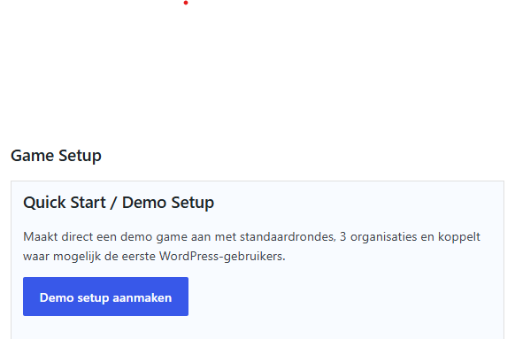
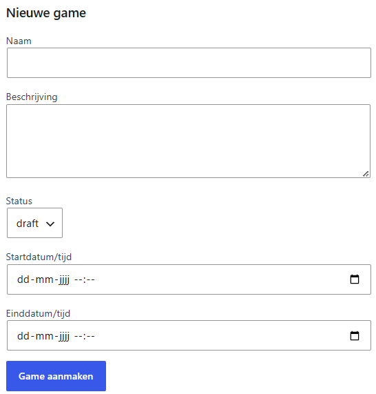
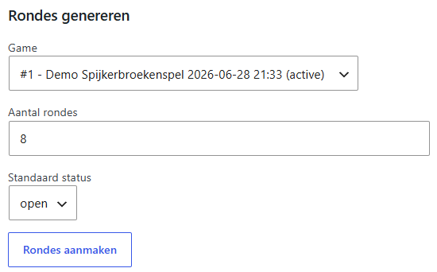
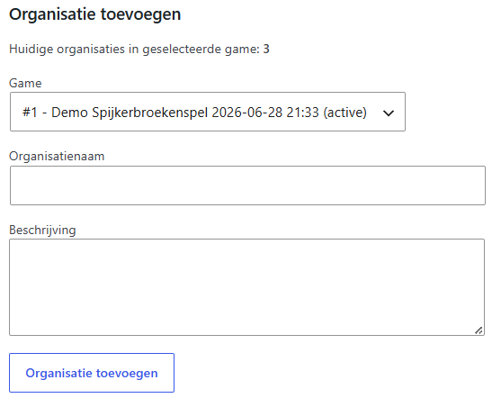
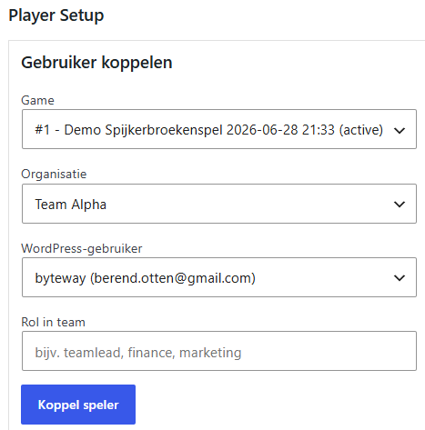
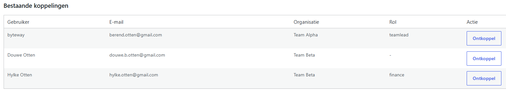
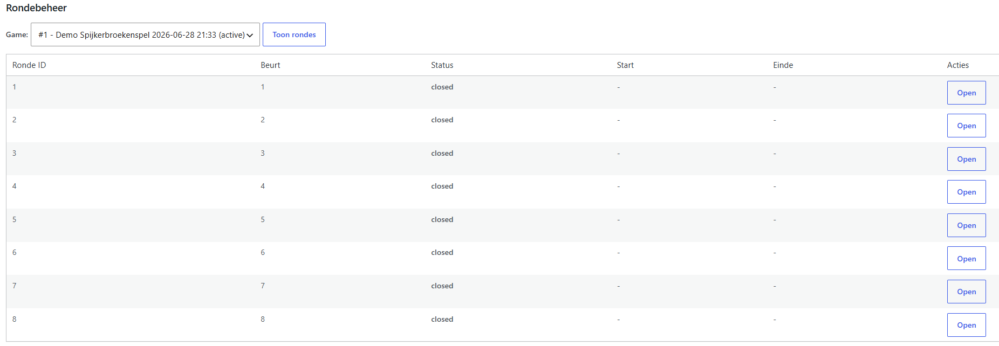
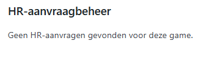
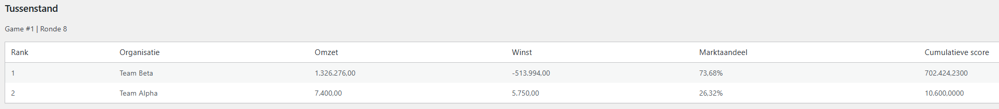
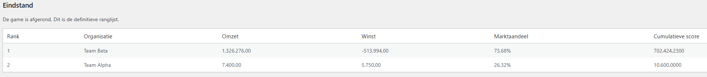

### Team / Speler

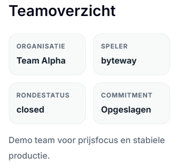
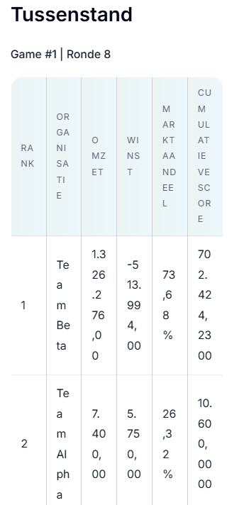
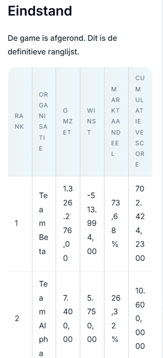
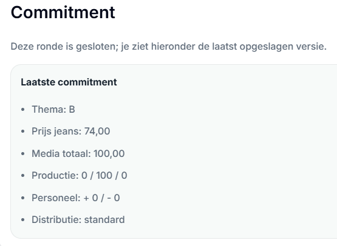

---

## 🎯 Doel van deze plugin

De plugin ondersteunt het digitale spijkerbroekenspel en biedt een centrale omgeving waarin:

- Spellen worden beheerd door een admin
- Spelers (leveranciers) hun keuzes invoeren
- Resultaten per beurt automatisch inzichtelijk worden
- Eindstanden en evaluaties worden gegenereerd

De plugin is **turn-based** en heeft een duidelijk start- en eindmoment.

---

## 🧩 Concept van het spel

Het spijkerbroekenspel is een simulatie waarbij meerdere leveranciers strijden om:

- Winst
- Marktaandeel
- Efficiënte productie en marketing

Na elke beurt ontvangen teams een update van hun prestaties en passen zij hun strategie aan.

De leverancier die aan het einde het beste presteert, wint het spel.

---

## 🏢 Organisatie

- Spelers worden verdeeld in teams (max 8 personen)
- Elk team vormt een leverancier
- Binnen een team worden rollen verdeeld:
  - CEO
  - Assistent directeur
  - Marketing manager
  - Productie manager
  - Medewerker

---

## 🎯 Doelen van spelers

Teams nemen strategische beslissingen per beurt:

- Investeren in marketing (per medium)
- Bepalen van prijs per segment
- Selecteren van doelgroep en productieaantallen
- Beheer van personeel (in- en uitstroom)
- Analyseren van resultaten per beurt

---

## 📐 Spelregels

- Ingevoerde keuzes zijn definitief per beurt
- Wijzigingen gaan pas in bij de volgende beurt
- Historische data mag niet aangepast worden
- Personeelswijzigingen worden vertraagd verwerkt
- Prijzen en teamdata zijn vertrouwelijk

---

## 🔄 Game flow (turn-based)

1. Nieuwe beurt start  
2. Analyse van vorige resultaten  
3. Teamoverleg  
4. Invoeren keuzes (Game Commitment)  
5. Verzenden wijzigingen  
6. Wachten op verwerking en resultaat  

---

## 📝 Registratieproces

1. Gebruiker registreert zich (WordPress user)
2. Gebruiker kiest een team (leverancier)
3. Gebruiker neemt deel aan een game
4. Gebruiker kan keuzes invoeren per beurt

---

## 🏆 Wincondities

De eindscore wordt bepaald op basis van:

- Omzet / winst
- Marktaandeel
- Aantal medewerkers
- Efficiëntie in productie en distributie

---

## 📊 Eind evaluatie

De evaluatie bevat:

### Marktaandeel
- Positie per leverancier

### Reclame
- Doelgroep vs segment
- Budget
- Mediakeuze

### Prijsstrategie
- Prijs per segment
- Effect op verkoop

### Productie
- Over- of onderproductie
- Distributiekosten

---

# ⚙️ Game setup (Plugin architectuur)

## 📌 Overzicht entiteiten

De plugin bevat de volgende kernentiteiten:

- **Game**
- **Player**
- **Team**
- **Game Commitment (per beurt)**

---

## 🔐 Admin functionaliteit

Toegankelijk via:
`WordPress admin → Spijkerbroekenspel`

### 1. Game beheer
**Velden:**
- ID
- Naam
- Omschrijving
- Startdatum/tijd
- Einddatum/tijd

**Functionaliteit:**
- Starten / stoppen van spel
- Berekenen tussenstand
- Berekenen eindstand

---

### 2. Player beheer
**Bron:** WordPress user

**Velden:**
- WordPress user
- Email
- Team ID

---

### 3. Team beheer
**Velden:**
- ID
- Naam
- Omschrijving

---

### 4. Game Commitment beheer (admin view)

Per beurt en per team:

- Game ID
- Team ID
- Turn nummer
- Reclame-uitgaven per medium
- Prijs per segment
- Productieaantallen per doelgroep
- Medewerkers in dienst
- Medewerkers uit dienst

---

## 🌐 Public Player functionaliteit

### 1. Registratieformulier
- Aanmaken WordPress user
- Koppelen aan team

---

### 2. Game Commitment invoerformulier

Per beurt:

- Game ID
- Team ID
- Game Turn Number

**Marketing**
- Reclame medium
- Reclame budget

**Prijs**
- Segment keuze
- Prijsstelling

**Productie**
- Doelgroep keuze
- Productie aantal

**Personeel**
- Medewerkers in dienst
- Medewerkers uit dienst

---

### 3. Tussenstand (read-only)

Per team:

- Leverancier (team)
- Winst
- Marktaandeel
- Reclame-uitgaven
- Prijsstrategie
- Productieaantallen

---

### 4. Eindstand (read-only)

Zelfde structuur als tussenstand, maar definitief.

---

## 🧱 Technische uitgangspunten (voor implementatie)

- WordPress plugin architectuur
- Gebruik van:
  - Custom post types of custom tables
  - User meta voor player koppelingen
- Turn-based logica per game
- Shortcodes of blocks voor frontend formulieren:
  - `[bso_register]`
  - `[bso_commitment]`
  - `[bso_score]`

---

## ✅ Acceptatiecriteria

- [ ] Admin kan game aanmaken en starten  
- [ ] Users kunnen zich registreren  
- [ ] Users kunnen gekoppeld worden aan teams  
- [ ] Per beurt kunnen keuzes worden ingevoerd  
- [ ] Data wordt opgeslagen per team en beurt  
- [ ] Tussenstand kan worden weergegeven  
- [ ] Eindstand wordt correct berekend  

---

## ✅ Einde

Bedankt voor het gebruiken van de Spijkerbroekenspel plugin. 