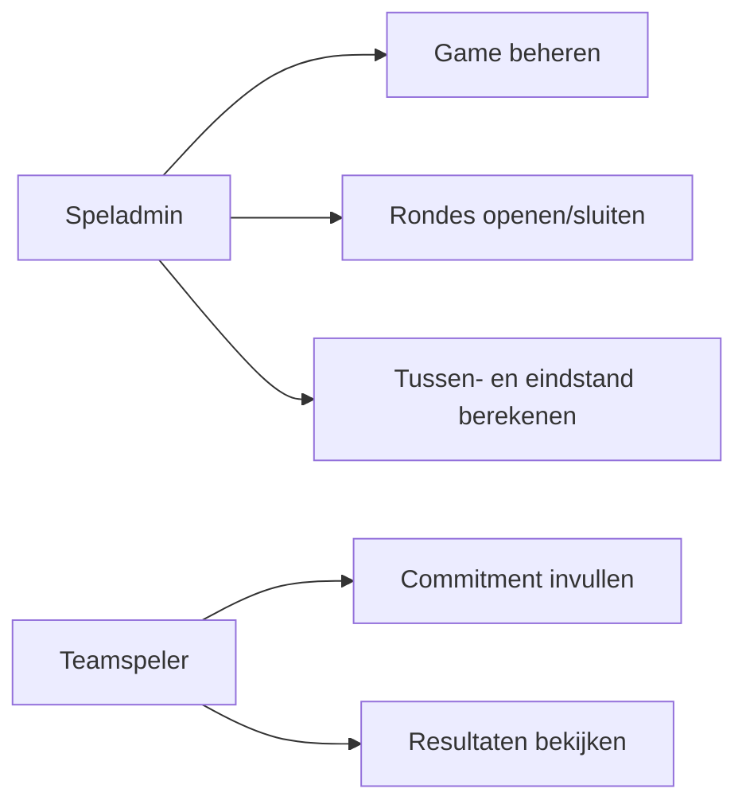
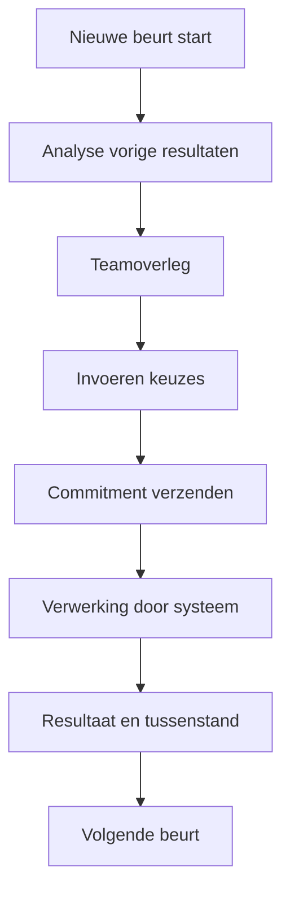
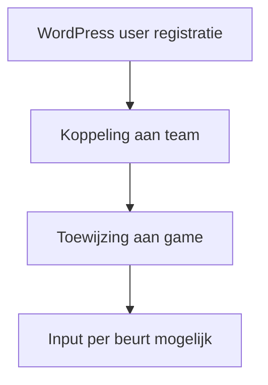
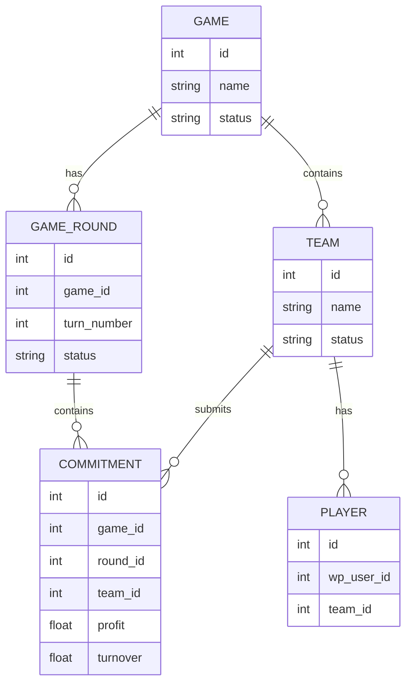
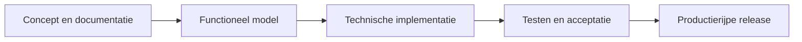

# Functioneel Ontwerp - BSO Spijkerbroek

**Plugin:** `bso-spijkerbroek`  
**Versie:** MVP / conceptfase  
**Datum:** 28 juni 2026  
**Platform:** WordPress

---

## Inhoudsopgave

1. [Inleiding en doel](#1-inleiding-en-doel)
2. [Bronnen en scope van analyse](#2-bronnen-en-scope-van-analyse)
3. [Functionele visie van het spel](#3-functionele-visie-van-het-spel)
4. [Doelgroepen en rollen](#4-doelgroepen-en-rollen)
5. [Procesflows (spel en gebruikers)](#5-procesflows-spel-en-gebruikers)
6. [Functionele modules](#6-functionele-modules)
7. [Datamodel](#7-datamodel)
8. [Frontend en beheerweergaven](#8-frontend-en-beheerweergaven)
9. [Huidige implementatiestatus](#9-huidige-implementatiestatus)
10. [Acceptatiecriteria](#10-acceptatiecriteria)
11. [Doorontwikkelrichtingen](#11-doorontwikkelrichtingen)

---

## 1. Inleiding en doel

De plugin **BSO Spijkerbroek** digitaliseert het klassieke spijkerbroekenspel naar een schaalbare WordPress-oplossing. De kern is een turn-based simulatie waarin teams (leveranciers) per ronde strategische keuzes maken in marketing, prijs, productie en personeel.

Doelen van dit functioneel ontwerp:

- spelconcept en businessregels eenduidig vastleggen
- functionele modules voor admin en spelers structureren
- datamodel definiëren voor toekomstige implementatie
- huidige codebasis expliciet positioneren ten opzichte van de gewenste functionaliteit

---

## 2. Bronnen en scope van analyse

Dit document is gebaseerd op alle beschikbare content in de map `bso-spijkerbroek` en subfolders:

- `README.md` (functionele visie, spelregels, rollen, modules, acceptatiecriteria)
- `readme.txt` (didactische context en productdoel)
- `document/Functional_Design.md` (bestaande datamodelschets)
- broncodebestanden:
  - `bso-spijkerbroek.php`
  - `includes/class-bso-spijkerbroek-activator.php`
  - `includes/class-bso-spijkerbroek-deactivator.php`
  - `assets/js/admin.js`
  - `assets/js/public.js`
  - `assets/css/admin.css`
  - `assets/css/public.css`
  - `uninstall.php`

---

## 3. Functionele visie van het spel

Het spijkerbroekenspel simuleert marktgedrag van concurrerende leveranciers. Teams bepalen per beurt hun strategie en krijgen daarop resultaatfeedback.

### Kernprincipes

- turn-based spel met duidelijke rondegrenzen
- keuzes per beurt zijn definitief
- resultaat van keuzes wordt pas in een volgende stap zichtbaar
- teams sturen op winst, marktaandeel en operationele efficiëntie
- historische rondedata blijft onveranderbaar

### Didactische doelstelling

De plugin ondersteunt economieonderwijs door theorie direct te koppelen aan praktijkbesluiten en gevolgen.

---

## 4. Doelgroepen en rollen

| Rol | Beschrijving | Functionele rechten |
|-----|--------------|---------------------|
| Speladmin | Start en beheert games, rondes en berekeningen | game lifecycle, teamindeling, tussen/eindstanden |
| Teamspeler | Levert strategische input per beurt | commitment invullen en opvolgen |
| Teamrollen | CEO, Assistent directeur, Marketing manager, Productie manager, Medewerker | rolverdeling binnen team, geen afwijkende systeemrechten gespecificeerd |

---

## 5. Procesflows (spel en gebruikers)

### 5.1 Spelflow per beurt

### 5.2 Registratie en deelname

### 5.3 Beslisdomeinen per team

- Marketingbudget per medium
- Prijsstrategie per segment
- Productieaantallen per segment/doelgroep
- Personeelsmutaties (instroom/uitstroom)

---

## 6. Functionele modules

### 6.1 Adminmodules

1. **Game beheer**
   - game aanmaken
   - start/stop game
   - tussenstand en eindstand berekenen

2. **Team beheer**
   - teams beheren (naam, omschrijving)
   - spelers koppelen aan teams

3. **Player beheer**
   - WordPress gebruikers koppelen aan game/teamcontext

4. **Commitment beheer (adminview)**
   - invoer en resultaten per ronde en per team monitoren

### 6.2 Frontendmodule

1. **Registratieflow speler**
2. **Commitment invoerformulier per beurt**
3. **Tussenstand (read-only)**
4. **Eindstand (read-only)**

### 6.3 Voorgestelde shortcode-interface

- `[bso_register]`
- `[bso_commitment]`
- `[bso_score]`

---

## 7. Datamodel

Het model hieronder combineert de bestaande datamodelschets met de functionele eisen uit README.

### 7.1 Entiteiten

1. Game
2. Game Round
3. Team
4. Player
5. Game Commitment
6. Game Parameters

### 7.2 Tabellen en velden (doelmodel)

#### Tabel `wp_bso_games`

- `id` (PK)
- `name`
- `description`
- `start_datetime`
- `end_datetime`
- `status` (`draft` / `active` / `finished`)

#### Tabel `wp_bso_game_rounds`

- `id` (PK)
- `game_id` (FK -> `wp_bso_games.id`)
- `turn_number`
- `start_datetime`
- `end_datetime`
- `status` (`open` / `closed` / `calculated`)

#### Tabel `wp_bso_teams`

- `id` (PK)
- `name`
- `description`
- `status` (`active` / `inactive`)

#### Tabel `wp_bso_players`

- `id` (PK)
- `wp_user_id` (FK -> `wp_users.ID`)
- `team_id` (FK -> `wp_bso_teams.id`)
- `email`
- `display_name`
- `role_in_team`

#### Tabel `wp_bso_commitments`

Basis:
- `id` (PK)
- `game_id` (FK)
- `round_id` (FK)
- `team_id` (FK)

Inputvelden:
- `advertisement_tv`
- `advertisement_newspaper`
- `advertisement_family_weekly`
- `advertisement_luxury_weekly`
- `marketing_research`
- `price_jeans`
- `price_factor`
- `production_segment_1`
- `production_segment_2`
- `production_segment_3`
- `distribution_form`
- `theme`
- `hiring_staff`
- `layoff_staff`

Berekende velden:
- `total_amount`
- `turnover`
- `profit`
- `sale`
- `market_index`
- `total_employees`
- `media_total`
- `advertisement_factor`

#### Tabel `wp_bso_game_parameters`

- `id` (PK)
- `variable_name`
- `numeric_value`

Voorbeelden:
- `max_players_per_team`
- `default_price_factor`
- `marketing_effect_factor`
- `production_cost`
- `number_of_turns`

### 7.3 Relatiemodel

---

## 8. Frontend en beheerweergaven

### 8.1 Beheerweergaven

- Game overzicht met lifecycle acties
- Team en spelerbeheer
- Commitment monitor per ronde
- Scoreberekening (tussen/eind)

### 8.2 Frontendweergaven

- Registratie + teamkeuze
- Commitmentformulier per actieve beurt
- Scoreoverzicht met teamvergelijking

### 8.3 KPI-weergaven (eind evaluatie)

- marktaandeel
- reclame-effect
- prijsstrategie-impact
- productie-efficiëntie

---

## 9. Huidige implementatiestatus

Deze sectie koppelt de gewenste functionaliteit aan de actuele code in de map.

### 9.1 Wat is aanwezig

- basis plugin bootstrapbestand (`bso-spijkerbroek.php`)
- verwijzingen naar activator/deactivator structuur
- basis uninstall bestand
- admin/public JS-bestanden met polling op `bso_dashboard_data`
- placeholders voor admin/public CSS
- functionele documentatie en datamodelschets

### 9.2 Wat ontbreekt in de huidige code

- `includes/class-bso-plugin.php` ontbreekt fysiek, terwijl bootstrap dit vereist
- activator en deactivator bestanden zijn leeg
- uninstall bevat geen functionele cleanup
- geen concrete databasecreatie of CRUD-implementatie
- geen shortcode- of blockregistratie aanwezig
- geen uitgewerkte AJAX endpoint implementatie in huidige pluginmap

### 9.3 Functionele consequentie

De plugininhoud representeert momenteel vooral een **concept/MVP-ontwerpfase**. Dit document geldt daarom als functioneel targetmodel voor implementatie.

---

## 10. Acceptatiecriteria

| Criterium | Status target |
|-----------|---------------|
| Admin kan game aanmaken en starten | Vereist |
| Users kunnen zich registreren | Vereist |
| Users kunnen gekoppeld worden aan teams | Vereist |
| Per beurt kunnen keuzes worden ingevoerd | Vereist |
| Data wordt opgeslagen per team en beurt | Vereist |
| Tussenstand kan worden weergegeven | Vereist |
| Eindstand wordt correct berekend | Vereist |

---

## 11. Doorontwikkelrichtingen

1. Realiseer ontbrekende kernklasse en plugin lifecycle (`class-bso-plugin.php`, activator/deactivator).
2. Implementeer custom tabellen conform hoofdstuk 7.
3. Bouw admin CRUD voor game/team/player/round/commitment.
4. Implementeer frontend shortcodes en inputvalidatie.
5. Ontwikkel berekeningsengine voor tussenstand en eindstand.
6. Voeg rechtenmodel, audittrail en testset toe.

---

*Gegenereerd op 28 juni 2026 - BSO Spijkerbroek Functioneel Ontwerp (gebaseerd op volledige mapanalyse)*