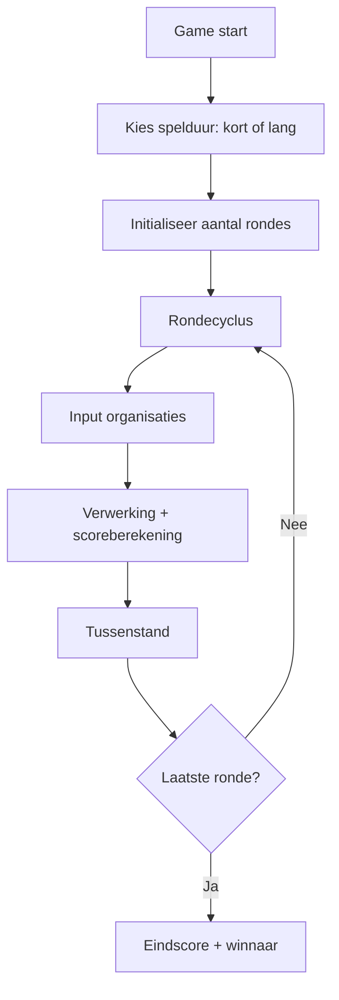
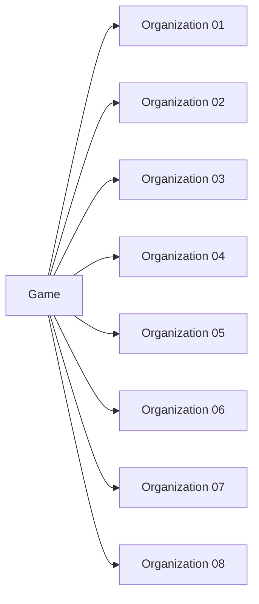
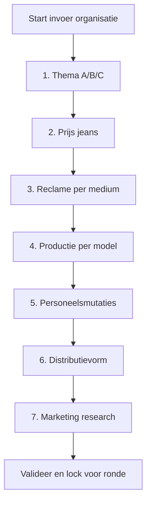
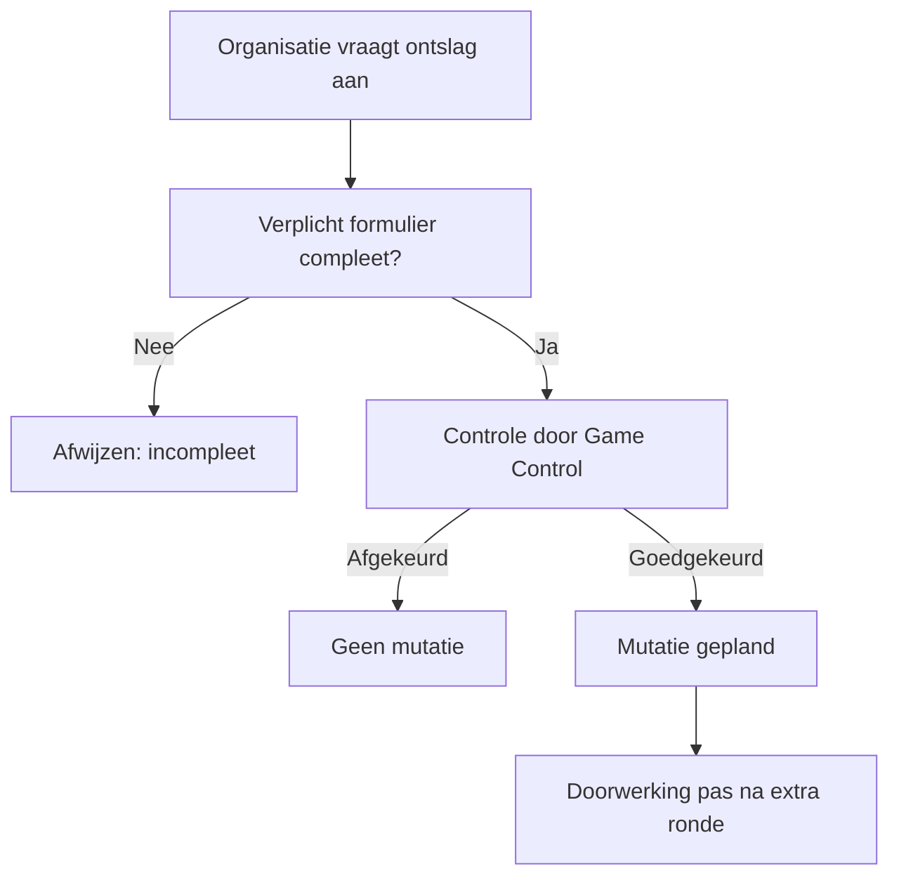
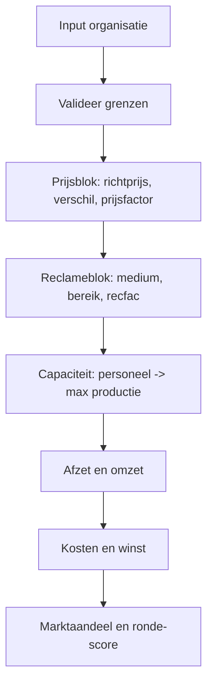
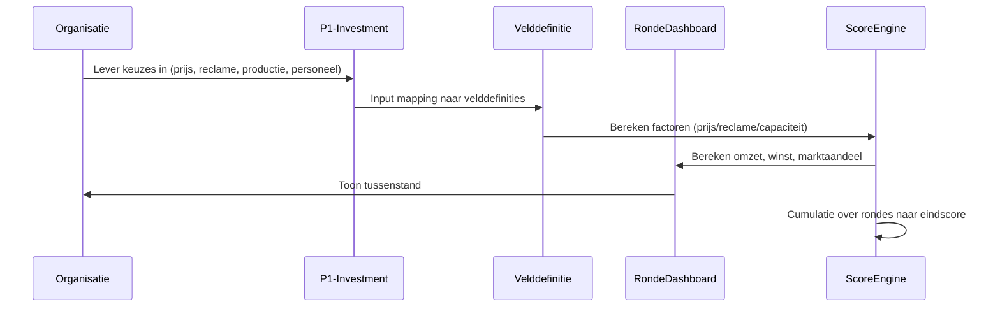
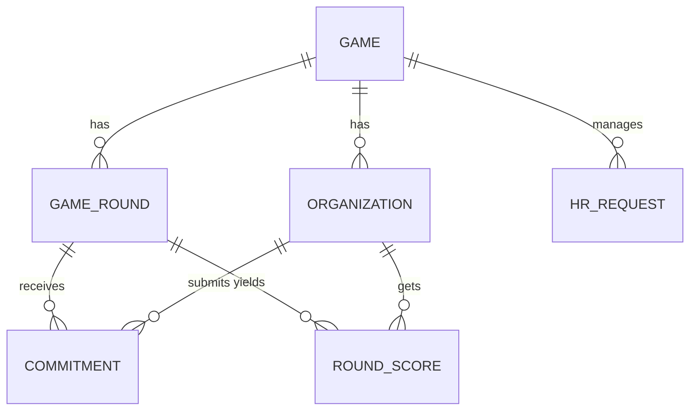

# Game Control - Analyse en Implementatiegids (BSO Spijkerbroek)

**Bronbestand:** `Game_Control.xls`  
**Doel:** functionele en rekentechnische vertaling naar implementatie in de WordPress-plugin `bso-spijkerbroek`  
**Datum:** 28 juni 2026

---

## Inhoudsopgave

1. [Inleiding en werkwijze](#1-inleiding-en-werkwijze)
2. [Tabblad Programma](#2-tabblad-programma)
3. [Tabblad Organisatie](#3-tabblad-organisatie)
4. [Tabblad P1-Investment](#4-tabblad-p1-investment)
5. [Tabblad Ronde01](#5-tabblad-ronde01)
6. [Tabblad Letter-of-Resignation](#6-tabblad-letter-of-resignation)
7. [Tabblad Velddefinitie](#7-tabblad-velddefinitie)
8. [Scoreketen: hoe berekeningen doorwerken](#8-scoreketen-hoe-berekeningen-doorwerken)
9. [Doel-datamodel voor pluginimplementatie](#9-doel-datamodel-voor-pluginimplementatie)
10. [Implementatieblauwdruk in WordPress](#10-implementatieblauwdruk-in-wordpress)
11. [Open punten en validatie tijdens bouw](#11-open-punten-en-validatie-tijdens-bouw)

---

## 1. Inleiding en werkwijze

Dit document vat alle relevante tabbladen van `Game_Control.xls` samen en maakt er een logisch, implementeerbaar geheel van voor de plugin `bso-spijkerbroek`.

### Brongegevens die zijn meegenomen

- tabbladen: `Programma`, `Organization`, `P1-Investment`, `Ronde01`, `Velddefinitie`, `Letter-of-Resignation`
- veld- en formulelabels uit de workbook (o.a. prijsfactor, reclamefactor, omzet, winst, marktaandeel)
- aanvullende context uit bestaande projectdocumentatie

### Belangrijk uitgangspunt

Niet alle voorbeeldcellen in de workbook zijn gevuld. Daarom is dit document opgesteld als:

- functionele reconstructie van de spelregels
- technisch doelontwerp dat tijdens implementatie nog met testdata gevalideerd moet worden

---

## 2. Tabblad Programma

Dit tabblad beschrijft de **spelstroom** en het onderscheid tussen korte en lange speelduur.

### Functionele bedoeling

- het ritme van rondes bepalen
- aantal speelbeurten (turns) vastleggen
- moment van tussenstanden en eindstand bepalen

### Verschil korte vs lange speelduur

- **Korte variant**: minder rondes, sneller leereffect, minder strategische herstelruimte
- **Lange variant**: meer rondes, cumulatieve effecten sterker zichtbaar, meer strategische correctie mogelijk

### Doorwerking naar score

Spelduur beïnvloedt direct:

- het aantal keren dat winst/omzet/marktaandeel wordt gecumuleerd
- de kans op inhaalstrategieën
- de gevoeligheid voor foutieve keuzes in vroege rondes

---

## 3. Tabblad Organisatie

Dit tabblad bevat voorbeeldorganisaties (tot 8 teams/leveranciers).

### Functionele bedoeling

- basisidentiteit van deelnemende organisaties
- vergelijkingskader per ronde
- startpunt voor toewijzing van spelers aan teams

### Gevonden structuurindicaties

- `Organization 01` t/m `Organization 08`
- teamlabels (`Team 1` t/m `Team 8`)
- opmerking in bron: niet alle voorbeelddata is ingeladen

### Doorwerking naar score

Per organisatie worden per ronde scorecomponenten vastgelegd. De eindscore is de cumulatie over alle rondes voor dezelfde organisatie.

---

## 4. Tabblad P1-Investment

Dit tabblad beschrijft de **invoer vóór einde speelbeurt**. Het is de primaire bron voor beslissingen per organisatie.

### Invoerblokken

1. **Themakeuze** (A/B/C)
2. **Prijsstelling** (`Price Jeans`)
3. **Reclame-uitgaven**
   - Family Weekly
   - Luxury Weekly
   - Newspaper
   - TV Spots
4. **Productiekeuze**
   - Tight / Half-Width / Wide
5. **Personeelsmutaties**
   - Aanname personeel
   - Ontslag personeel
6. **Distribution Form**
7. **Marketing Research**

### Doorwerking naar score

- themakeuze bepaalt richtprijskader
- prijs beïnvloedt afzetkans en omzet
- reclame bepaalt bereik/factor en beïnvloedt marktaandeel
- productie + personeel bepaalt levercapaciteit
- personeel werkt vertraagd door (aanname volgende ronde, ontslag na extra vertraging)

---

## 5. Tabblad Ronde01

Dit tabblad toont een voorbeeld-dashboard na afsluiting van ronde 1.

### Inzicht na ronde-afsluiting

- totale productie per broektype
- verkoop tegen gerealiseerde prijzen
- omzet en winst per organisatie
- marktaandeel per gekozen thema/product

### Dashboarddoel

Teams krijgen na iedere ronde feedback om strategie in volgende ronde bij te sturen.

### Doorwerking naar score

Ronde01 is de eerste scoremomentopname. Vanaf hier ontstaat:

- **tussenstand**: actuele positie op basis van ronde(s) tot nu toe
- **eindstand**: cumulatie van alle ronde-uitkomsten

---

## 6. Tabblad Letter-of-Resignation

Dit tabblad is een ontslagtemplate.

### Functionele bedoeling

- formele aanvraag voor personeelsreductie
- alle velden verplicht
- Game Control behoudt recht op afwijzing

### Procesvertaling voor plugin

### Doorwerking naar score

Ontslag beïnvloedt niet direct dezelfde ronde, maar latere capaciteit en kosten. Dat maakt planning over meerdere rondes cruciaal.

---

## 7. Tabblad Velddefinitie

Dit is het belangrijkste tabblad: hier wordt de vertaalslag van input naar score gedefinieerd.

## 7.1 Belangrijkste veldgroepen

- richtprijs per thema (`TARGET_PRICE_THEME_A/B/C`)
- prijsfactor / prijseffect
- reclamefactor en mediabereik
- productie- en personeelslimieten
- omzet, kosten, winst
- marktaandeel (`MARKET_SHARE_THEME_*`)

## 7.2 Herkende kernformules (zoals in workbook-labels)

### Omzet en winst

$$
omzet = prijs \times afzet
$$

$$
winst = omzet - kosten
$$

### Prijsafleiding rond richtprijs

Werkboekaanduidingen bevatten onder meer:

- `verschil = prijs - richtprijs`
- `effect = ALS(verschil > 0; ABS(verschil*2)+richtprijs; ABS(verschil)+richtprijs)`
- `prijsfactor = (1,1/effect) * richtprijs` (notatie komt uit bron; exacte operatorvolgorde valideren in implementatie)

### Variabele kostprijs (bronlabel)

$$
varkost = (prijs \times 0.2) + prijs + 15
$$

### Reclamefactor (bronlabel)

$$
recfac = manvrouw \times welstandsklasse \times mediumbereik \times reclameuitgaven
$$

### Reclame-uitgave (bronlabel)

$$
recuit = ALS(aantal > 0; (prijs\_per\_reclame \times aantal)/1000)
$$

## 7.3 Functionele regels uit Velddefinitie

- themakeuze bepaalt richtprijs (A goedkoop, B normaal, C duur)
- bij gelijk thema: hoogste combinatie van prijsfactor en reclamefactor wint
- totale productie mag maximale productie niet overschrijden
- gemiddelde productiecapaciteit per medewerker: 2500 per periode
- aangenomen personeel telt mee vanaf volgende ronde
- ontslag werkt een ronde later door na goedkeuring

---

## 8. Scoreketen: hoe berekeningen doorwerken

Deze keten verbindt alle tabbladen en maakt zichtbaar hoe een invoerkeuze de eindscore beïnvloedt.

### Concreet: doorwerking per beslisdomein

1. **Prijs**
   - beïnvloedt afzetkans via prijsverschil t.o.v. richtprijs
   - beïnvloedt omzet direct (`prijs * afzet`)
   - beïnvloedt kosten en dus winst

2. **Reclame**
   - verhoogt bereik/factor richting doelgroep
   - vergroot kans op verkoop en marktaandeel
   - verhoogt kosten (te hoge uitgaven kunnen winst drukken)

3. **Productie**
   - bepaalt leverbare aantallen
   - tekort remt omzet, overschot kan inefficiëntie veroorzaken

4. **Personeel**
   - bepaalt productiecapaciteit op basis van medewerkers
   - effecten zijn vertraagd, dus planning over meerdere rondes is essentieel

5. **Thema**
   - positioneert productsegment (A/B/C)
   - beïnvloedt richtprijs, doelgroepfit en competitieveld

### Eindscore

Eindscore = cumulatie van ronde-uitkomsten, met nadruk op omzet/winst/marktaandeel.

---

## 9. Doel-datamodel voor pluginimplementatie

### Kernentiteiten

- `games`
- `game_rounds`
- `organizations`
- `commitments`
- `round_scores`
- `game_parameters`
- `hr_requests` (o.a. resignation)

### Belangrijke technische constraints

- unieke commitment per organisatie per ronde
- immutable commitment na ronde-lock
- personeelsmutaties met `effective_round`
- formuleversie opslaan voor reproduceerbaarheid

---

## 10. Implementatieblauwdruk in WordPress

## 10.1 Adminschermen

1. Programma-instellingen (korte/lange game)
2. Organisaties beheren
3. Rondebeheer en ronde-lock
4. Ingekomen commitments
5. HR-aanvragen (ontslag)
6. Dashboard en score-overzichten

## 10.2 Frontendschermen

1. Organisatie-invoer (P1-Investment)
2. Ontslagaanvraagformulier
3. Ronde-dashboard (na sluiting)

## 10.3 Verwerkingspipeline

## 10.4 Aanbevolen technische modules

- `BSO_Game_Program_Service`
- `BSO_Organization_Repo`
- `BSO_Commitment_Repo`
- `BSO_HR_Request_Service`
- `BSO_Scoring_Engine`
- `BSO_Round_Dashboard_Service`

---

## 11. Open punten en validatie tijdens bouw

1. Exacte operatorvolgorde van prijsfactorformule valideren met originele rekenbladen.
2. Alle mediacategorieen en doelgroepgewichten 1-op-1 overnemen uit Velddefinitie.
3. Regelset voor marktaandeel bij gelijke score expliciet coderen (tie-breakers).
4. Testset per ronde opbouwen (golden files) voor regressiecontrole.
5. Rekenkern versiebeheer toevoegen zodat resultaten historisch reproduceerbaar blijven.

---

## Samenvatting

`Game_Control.xls` beschrijft een complete game-engine met invoer (P1), verwerking (Velddefinitie), terugkoppeling (Ronde-dashboard) en personeelsgovernance (resignation). De plugin `bso-spijkerbroek` kan dit robuust implementeren door commitments per ronde te locken, formulegestuurd te scoren, en alle effecten (prijs/reclame/productie/personeel) transparant in dashboard en eindscore door te laten werken.

---

*Gegenereerd op 28 juni 2026 - Analyse van Game_Control.xls voor implementatie in bso-spijkerbroek*
