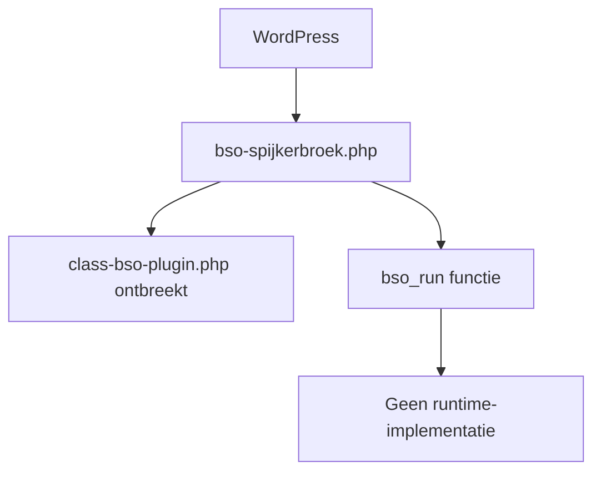
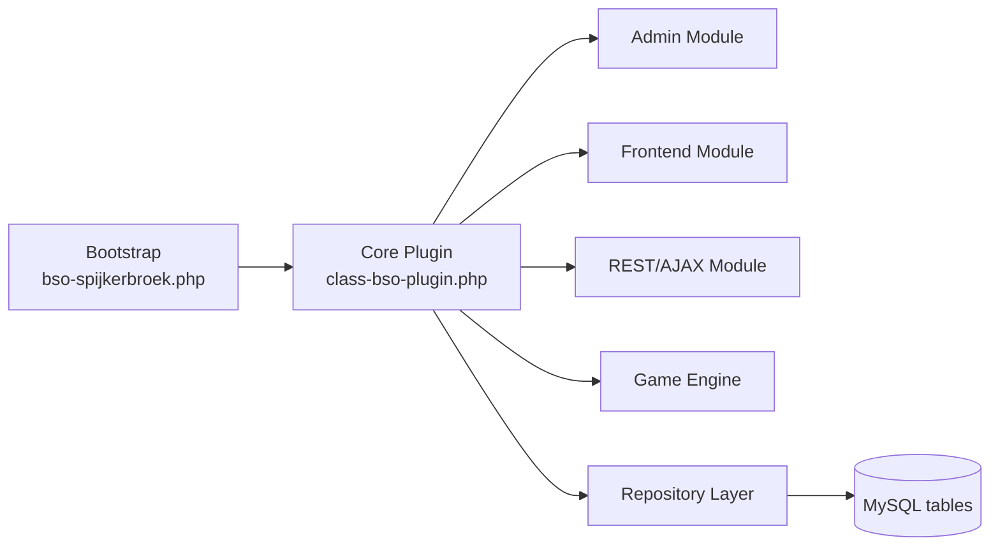
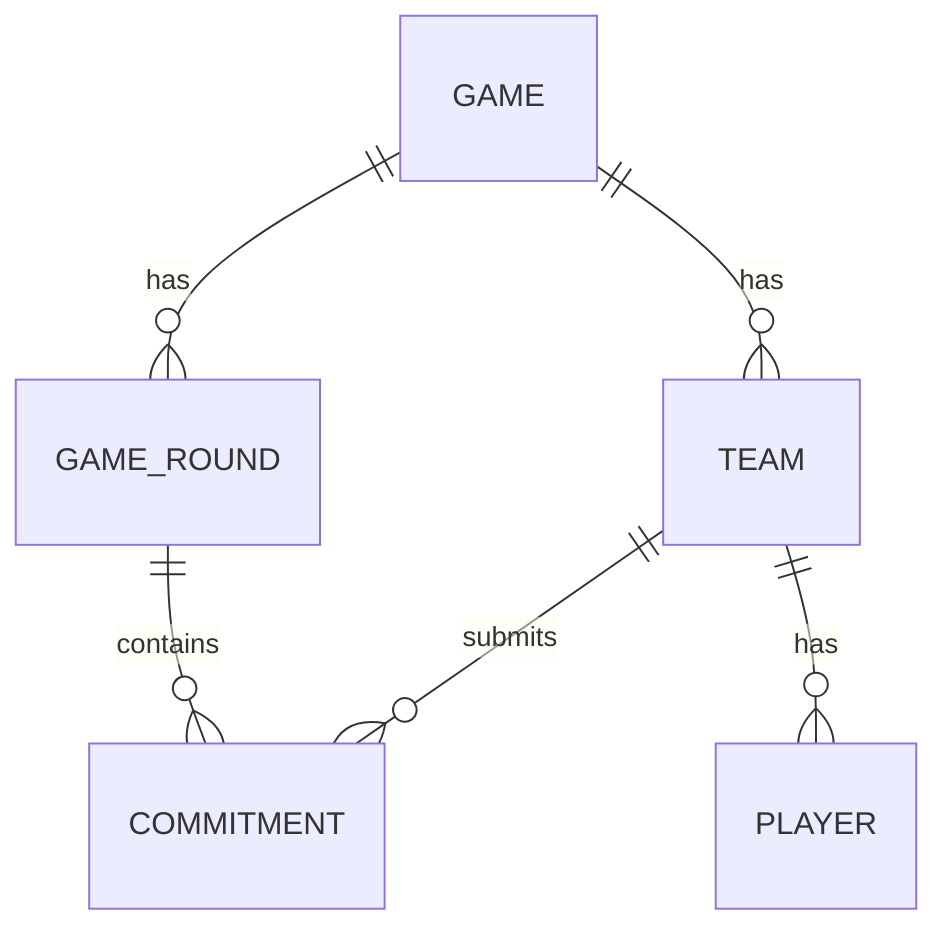
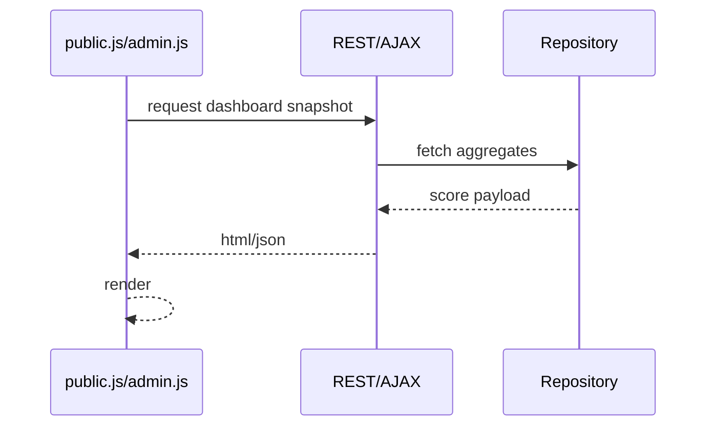
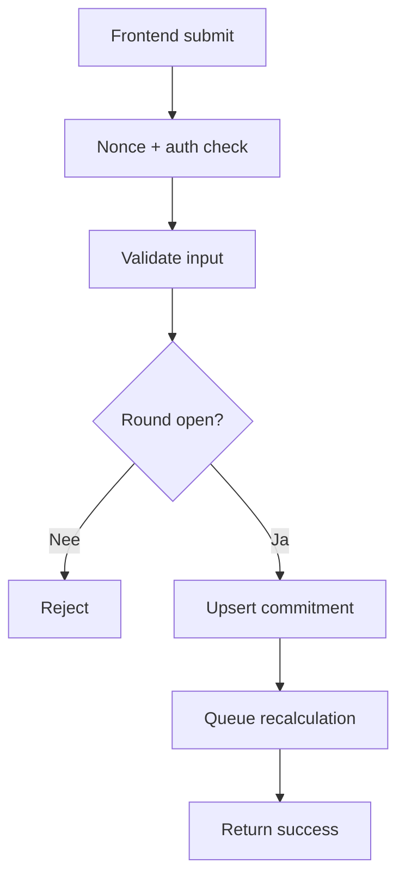

# Technisch Ontwerp - BSO Spijkerbroek

**Plugin:** `bso-spijkerbroek`  
**Versie:** MVP / conceptfase  
**Datum:** 28 juni 2026  
**Platform:** WordPress (PHP + MySQL + JavaScript)

---

## Inhoudsopgave

1. [Doel en context](#1-doel-en-context)
2. [Technische scope en bronbasis](#2-technische-scope-en-bronbasis)
3. [Huidige code-architectuur](#3-huidige-code-architectuur)
4. [Doelarchitectuur](#4-doelarchitectuur)
5. [Databaselaag en schemaontwerp](#5-databaselaag-en-schemaontwerp)
6. [Backend componenten](#6-backend-componenten)
7. [Frontend componenten](#7-frontend-componenten)
8. [API- en datastromen](#8-api--en-datastromen)
9. [Rollen en autorisatie](#9-rollen-en-autorisatie)
10. [Validatie en business rules](#10-validatie-en-business-rules)
11. [Beveiliging, logging en betrouwbaarheid](#11-beveiliging-logging-en-betrouwbaarheid)
12. [Implementatiefases en roadmap](#12-implementatiefases-en-roadmap)
13. [Known Gaps in huidige code](#13-known-gaps-in-huidige-code)

---

## 1. Doel en context

Dit document vertaalt het functionele ontwerp van het Spijkerbroekenspel naar een technisch realiseerbaar ontwerp.

Doelen:

- de implementatie-architectuur vastleggen
- componentverantwoordelijkheden scheiden
- dataopslag en interfaces specificeren
- een veilige migratieroute bieden van concept naar productierijpe plugin

---

## 2. Technische scope en bronbasis

De technische specificatie is gebaseerd op:

- `README.md` (spelconcept, rollen, modules, acceptatiecriteria)
- `readme.txt` (didactische context)
- `document/Functional_Design.md` (target datamodel)
- huidige codebestanden:
	- `bso-spijkerbroek.php`
	- `includes/class-bso-spijkerbroek-activator.php` (leeg)
	- `includes/class-bso-spijkerbroek-deactivator.php` (leeg)
	- `assets/js/admin.js`
	- `assets/js/public.js`
	- `assets/css/admin.css` (placeholder)
	- `assets/css/public.css` (placeholder)
	- `uninstall.php` (placeholder)

---

## 3. Huidige code-architectuur

### Feitelijke status

- bootstrapbestand laadt `includes/class-bso-plugin.php`
- die klasse ontbreekt in de map
- activator/deactivator zijn nog leeg
- JS bevat polling op `bso_dashboard_data`, maar endpoint bestaat nog niet in deze plugin
- CSS is nog niet ingevuld

### Huidige laadstructuur



---

## 4. Doelarchitectuur

### Architectuurprincipes

- duidelijke laagindeling: bootstrap, domain, persistence, admin UI, frontend UI
- game-engine logica los van presentatie
- immutable rondehistorie
- capability-based toegang op adminacties

### Voorgestelde componentarchitectuur



### Mappenstructuur (doel)

```text
bso-spijkerbroek/
	bso-spijkerbroek.php
	includes/
		class-bso-plugin.php
		class-bso-spijkerbroek-activator.php
		class-bso-spijkerbroek-deactivator.php
		class-bso-repo-games.php
		class-bso-repo-rounds.php
		class-bso-repo-teams.php
		class-bso-repo-players.php
		class-bso-repo-commitments.php
		class-bso-game-engine.php
		class-bso-validator.php
		class-bso-rest-controller.php
	admin/
		page-games.php
		page-rounds.php
		page-teams.php
		page-players.php
		page-commitments.php
	public/
		shortcodes.php
	assets/
		css/admin.css
		css/public.css
		js/admin.js
		js/public.js
	uninstall.php
```

---

## 5. Databaselaag en schemaontwerp

De plugin gebruikt custom tables (geen CPT) vanwege relationele game-data en aggregaties per beurt.

### Tabellen

1. `wp_bso_games`
2. `wp_bso_game_rounds`
3. `wp_bso_teams`
4. `wp_bso_players`
5. `wp_bso_commitments`
6. `wp_bso_game_parameters`

### Relaties



### Indexeringsrichtlijn

- `wp_bso_game_rounds`: index op `(game_id, turn_number)`
- `wp_bso_players`: unieke index op `(wp_user_id, team_id)`
- `wp_bso_commitments`: unieke index op `(game_id, round_id, team_id)`
- `wp_bso_commitments`: index op `(team_id)` en `(round_id)`

### Integriteitsregels

- per team exact 1 commitment per ronde
- ronde met status `closed` is niet meer bewerkbaar
- commitments in gesloten rondes zijn immutable

---

## 6. Backend componenten

### 6.1 Bootstrap (`bso-spijkerbroek.php`)

Verantwoordelijkheden:

- constants en paden initialiseren
- core pluginklasse laden
- run-sequence starten

### 6.2 Activator/Deactivator

**Activator**
- tabellen aanmaken met `dbDelta`
- defaults voor game parameters seeds

**Deactivator**
- scheduled tasks netjes uitschakelen
- geen dataverlies

### 6.3 Core Plugin klasse (`class-bso-plugin.php`)

Verantwoordelijkheden:

- hook-registratie
- dependency wiring
- register admin menus
- register shortcodes
- register REST/AJAX handlers

### 6.4 Game Engine

Functies:

- rondeberekening per team
- score aggregatie tussenstand/eindstand
- winnaardeterminatie

### 6.5 Repositories

- encapsuleren SQL
- input/output normalisatie
- transactiegrenzen voor bulkberekeningen

---

## 7. Frontend componenten

### 7.1 Shortcodes

- `[bso_register]`
- `[bso_commitment]`
- `[bso_score]`

### 7.2 Form handling

- nonce per formulier
- capability en game-state checks server-side
- dubbele submit preventie (idempotent op `(game_id, round_id, team_id)`)

### 7.3 Dashboard polling

Huidige JS pollt elke 5 seconden op `bso_dashboard_data`. In doelarchitectuur wordt dit gekoppeld aan:

- AJAX action of REST endpoint voor scorefragment
- throttle/backoff bij fouten



---

## 8. API- en datastromen

### 8.1 Aanbevolen endpoints

| Endpoint / action | Doel |
|-------------------|------|
| `POST /commitments` | commitment opslaan per team/ronde |
| `GET /scores` | tussenstand/eindstand ophalen |
| `GET /round-state` | actieve ronde + editability |
| `GET /dashboard` | compacte poll-response |

### 8.2 Commit-verwerkingsflow



---

## 9. Rollen en autorisatie

### Rollenmatrix

| Actie | Speler | Teamleider | Admin |
|------|--------|------------|-------|
| Commitment invoeren eigen team | Ja | Ja | Ja |
| Commitment andere teams | Nee | Nee | Ja |
| Ronde openen/sluiten | Nee | Nee | Ja |
| Tussenstand bekijken | Ja | Ja | Ja |
| Eindstand publiceren | Nee | Nee | Ja |

### WordPress capabilities

- adminfuncties op `manage_options`
- spelacties voor spelers via custom capabilityset of lidmaatschapscheck op teamkoppeling

---

## 10. Validatie en business rules

### Invoervalidatie

- numerieke velden: `>= 0`
- verplichte velden per domein (prijs, productie, marketing)
- ronde moet actief/open zijn

### Business rules

1. Commitments zijn definitief na ronde-sluiting.
2. Historische data is read-only.
3. Personeelswijzigingen hebben vertraagd effect (vanaf volgende ronde).
4. Teamprijzen zijn vertrouwelijk en niet publiek zichtbaar op detailniveau.

### Berekeningskader

Voor totale investering per commitment geldt:

$$
total\_amount = \sum marketing\_items + \sum production\_costs + personnel\_delta\_cost
$$

Voor winst:

$$
profit = turnover - total\_amount
$$

---

## 11. Beveiliging, logging en betrouwbaarheid

### Beveiliging

- nonce validatie op alle muterende requests
- server-side validatie (niet vertrouwen op JS)
- sanitization/escaping via WordPress helpers
- prepared statements via `$wpdb->prepare`

### Logging

- technische fouten via `error_log` of WP logging integratie
- optionele audittrail op adminacties (ronde sluiten, score publiceren)

### Betrouwbaarheid

- recalculatie in transactie (waar mogelijk)
- lock op rondeberekening om race conditions te voorkomen
- fallback bij polling failure in JS

---

## 12. Implementatiefases en roadmap

### Fase 1 - Foundation

1. `class-bso-plugin.php` toevoegen.
2. activator/deactivator implementeren.
3. databasetabellen aanmaken.
4. basis admin menu + pagina skeletons.

### Fase 2 - Core gameplay

1. team/player/game/round CRUD.
2. commitment input + opslag.
3. ronde statusbeheer.

### Fase 3 - Score engine

1. berekeningsengine implementeren.
2. tussenstand/eindstand views.
3. dashboard endpoint voor polling.

### Fase 4 - Hardening

1. beveiligingstest en validatie.
2. integratietests op turn-flow.
3. UX polish en rapportage-export.

---

## 13. Known Gaps in huidige code

1. `includes/class-bso-plugin.php` ontbreekt, waardoor runtime niet compleet is.
2. activator/deactivator bestanden zijn leeg.
3. `uninstall.php` bevat alleen placeholder comment.
4. CSS-bestanden bevatten nog geen styling.
5. JS pollt op een action die in deze codebase nog niet is geïmplementeerd.

Deze gaps zijn geen blokkade voor het ontwerp, maar wel voor directe productie-inzet.

---

*Gegenereerd op 28 juni 2026 - BSO Spijkerbroek Technisch Ontwerp*
