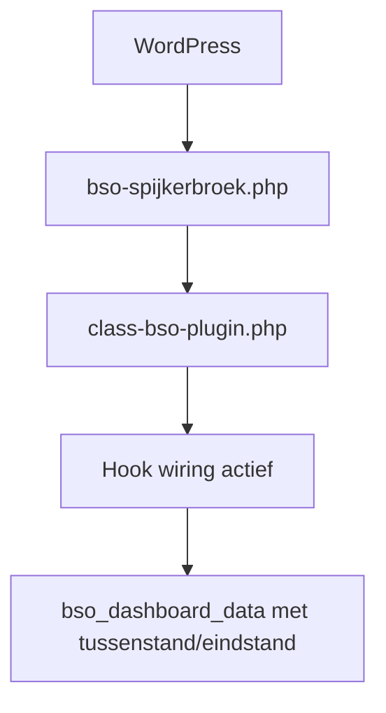
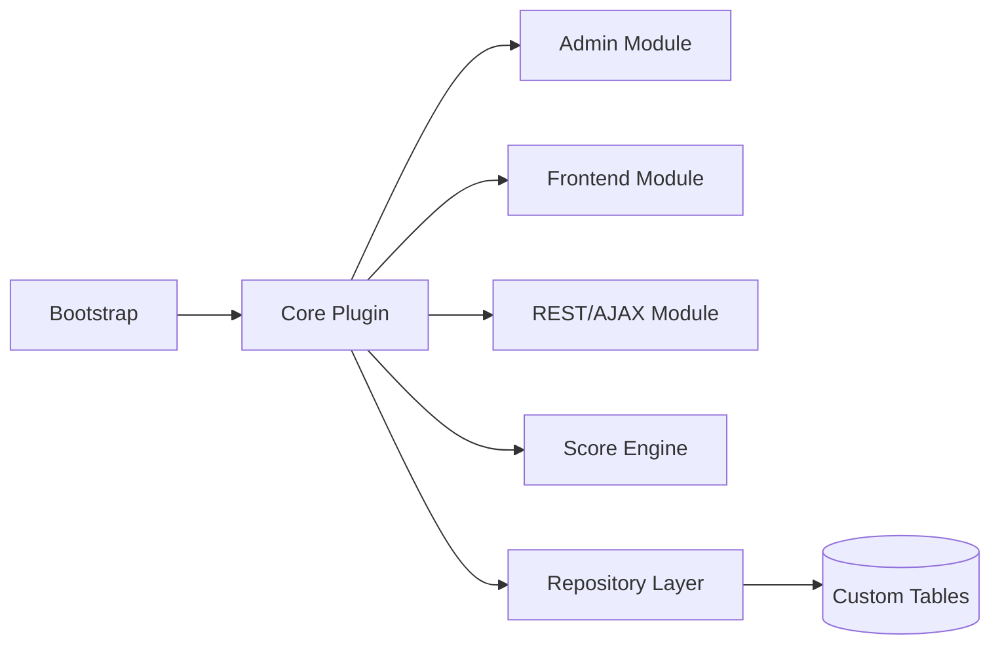
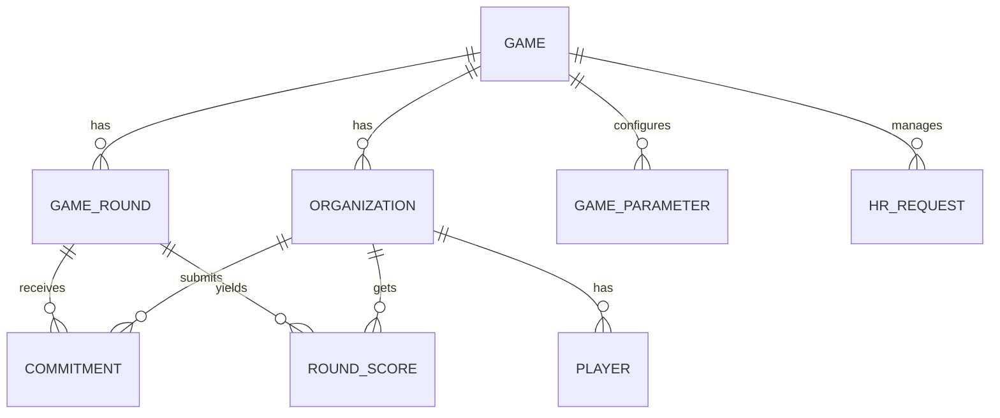
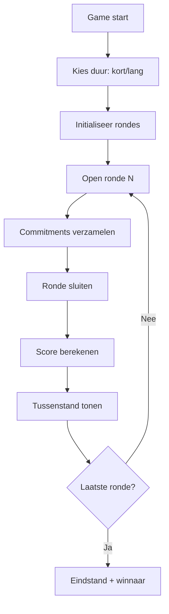
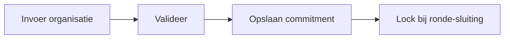
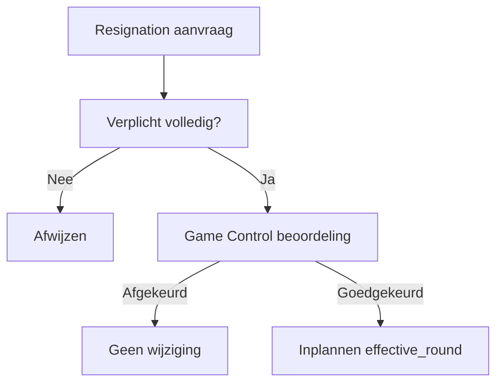
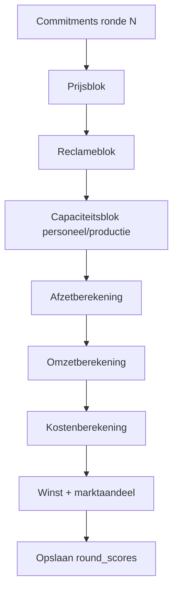
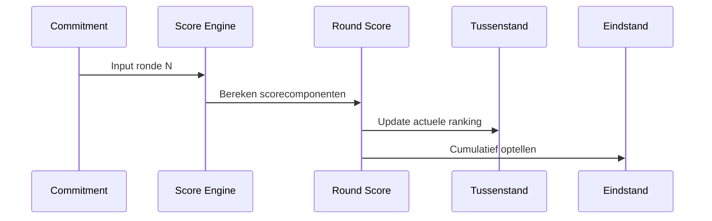

# Technisch Ontwerp v2 - BSO Spijkerbroek

**Plugin:** `bso-spijkerbroek`  
**Documentversie:** 2.1.6  
**Status:** In opbouw (implementatiegericht)  
**Datum:** 28 juni 2026  
**Doel:** 1 centrale technische blauwdruk voor stapsgewijze realisatie

---

## 1. Documentbesturing

### 1.1 Versiebeheer

| Versie | Datum | Wijziging | Auteur |
|--------|-------|-----------|--------|
| 2.0.0 | 2026-06-28 | Eerste gestroomlijnde versie op basis van Technical_Design + Game_Control | Copilot |
| 2.0.1 | 2026-06-28 | T05 geimplementeerd: score-engine rondeberekening + vullen `bso_round_scores` | Copilot |
| 2.0.2 | 2026-06-28 | T06 geimplementeerd: dashboard endpoint leest en toont tussenstand/eindstand uit `bso_round_scores` | Copilot |
| 2.0.3 | 2026-06-28 | T07 geimplementeerd: HR resignation verwerkt bij rondeafsluiting en doorwerking naar personeelscapaciteit | Copilot |
| 2.0.4 | 2026-06-28 | T08 geimplementeerd: golden regressietests en multiround HR-scenario toegevoegd | Copilot |
| 2.0.5 | 2026-06-28 | Werkboard geactualiseerd en uitgebreid met CI + vervolgtaken na T08 | Copilot |
| 2.0.6 | 2026-06-28 | T10 geimplementeerd: runtime DB regressietest tegen golden fixtures toegevoegd | Copilot |
| 2.0.7 | 2026-06-28 | T11 geimplementeerd: admin rondebeheer UI met openen/sluiten/lock en statushandler | Copilot |
| 2.0.8 | 2026-06-28 | T12 geimplementeerd: HR-aanvraagbeheer UI met approve/reject/reset en decision notes | Copilot |
| 2.0.9 | 2026-06-28 | T13 geimplementeerd: REST API endpoints voor commitments, scores en hr-requests | Copilot |
| 2.1.0 | 2026-06-28 | T14 geimplementeerd: formula-v2 validatieprotocol + afgedwongen golden update workflow | Copilot |
| 2.1.1 | 2026-06-28 | T15 geimplementeerd: Game Setup UI voor games, rondes en organisaties | Copilot |
| 2.1.2 | 2026-06-28 | T16 geimplementeerd: Player Setup UI voor koppeling van WP-gebruikers aan organisaties | Copilot |
| 2.1.3 | 2026-06-28 | T17 geimplementeerd: Quick Start / Demo Setup voor snelle speelbare testconfiguratie | Copilot |
| 2.1.4 | 2026-06-28 | Demo setup uitgebreid tot volledig speelbare testconfiguratie met snelle start | Copilot |
| 2.1.5 | 2026-06-28 | T18 geimplementeerd: organisatiegericht frontend/teamdashboard voor spelers | Copilot |
| 2.1.6 | 2026-06-28 | Game Ready werkboard + quick test stappen voor WordPress devsite toegevoegd | Copilot |

### 1.2 Projectstatus

| Onderdeel | Status | Opmerking |
|-----------|--------|-----------|
| Basis plugin bootstrap | Basis gereed | Runtime klasse + hook wiring aanwezig |
| Datamodel ontwerp | Geimplementeerd basis | dbDelta schema + parameter seeds actief |
| Scorelogica ontwerp | Geimplementeerd basis | v1-formule actief, bronbladvalidatie blijft open |
| Admin UI | Geimplementeerd uitgebreid | Setup UI voor games/rondes/organisaties/spelers + demo setup + rondebeheer + HR-aanvraagbeheer actief |
| Frontend formulieren | Geimplementeerd uitgebreid | Organisatiegericht teamdashboard + commitmentflow actief |
| API/AJAX laag | Geimplementeerd uitgebreid | Dashboard endpoint + REST routes voor commitments/scores/hr-requests |
| Release readiness | In voorbereiding | Game Ready smoke test, mobile check en contentplaatsing |

### 1.3 Werkboard (voor uitvoering)

| ID | Taak | Prioriteit | Status | Doelversie |
|----|------|------------|--------|------------|
| T01 | `class-bso-plugin.php` toevoegen + hook wiring | Hoog | Gereed | v2.1 |
| T02 | Activator/deactivator implementeren | Hoog | Gereed | v2.1 |
| T03 | DB tabellen aanmaken met `dbDelta` | Hoog | Gereed | v2.1 |
| T04 | Commitment inputflow + validatie | Hoog | Gereed | v2.2 |
| T05 | Score engine (rondeberekening) | Hoog | Gereed | v2.3 |
| T06 | Dashboard tussenstand/eindstand | Midden | Gereed | v2.3 |
| T07 | HR resignation workflow | Midden | Gereed | v2.4 |
| T08 | Testset + regressiechecks formules | Hoog | Gereed | v2.4 |
| T09 | CI workflow voor regressietests | Hoog | Gereed | v2.4 |
| T10 | Runtime regressietest (DB output vs golden fixtures) | Hoog | Gereed | v2.5 |
| T11 | Admin rondebeheer UI (openen/sluiten/lock) | Hoog | Gereed | v2.5 |
| T12 | HR-aanvraagbeheer UI (approve/reject + notes) | Midden | Gereed | v2.5 |
| T13 | REST API endpoints voor commitments/scores/hr | Midden | Gereed | v2.6 |
| T14 | Formula v2 validatie tegen bronmodel (golden update protocol) | Hoog | Gereed | v2.6 |
| T15 | Game Setup UI (games, rondes, organisaties) | Hoog | Gereed | v2.6 |
| T16 | Player Setup UI (WP-gebruikers koppelen aan organisaties) | Hoog | Gereed | v2.6 |
| T17 | Quick Start / Demo Setup | Midden | Gereed | v2.6 |
| T18 | Organisatiegericht frontend/teamdashboard voor spelers | Hoog | Gereed | v2.7 |

### 1.4 Werkboard - Game Ready

| ID | Taak | Prioriteit | Status | Doelversie |
|----|------|------------|--------|------------|
| T19 | Devsite smoke test: demo setup, dashboard en commitmentflow | Hoog | In uitvoering (technische smoke groen, devsite-run pending) | Game Ready |
| T20 | Shortcode en pagina plaatsen voor spelersdashboard | Hoog | Gereed | Game Ready |
| T21 | Spelerpad testen: login, teamherkenning, commitment submit, refresh | Hoog | In uitvoering | Game Ready |
| T22 | Responsive polish en lege-staten controle op mobiel/desktop | Midden | Niet gestart | Game Ready |
| T23 | Release checklist en handoff-notities voor beheerder | Midden | Niet gestart | Game Ready |

---

## 2. Scope en uitgangspunten

Deze versie combineert:

- architectuur en componentverdeling
- spelinvoer, scoreketen en formulelogica
- implementatiestappen richting werkende WordPress-plugin

### Kernuitgangspunten

1. Turn-based game met immutable afgesloten rondes.
2. Per organisatie exact 1 commitment per ronde.
3. Score is cumulatief over rondes.
4. Personeelseffecten zijn vertraagd in de tijd.
5. Formules moeten reproduceerbaar versioned worden opgeslagen.

---

## 3. Huidige situatie (as-is)

### 3.1 Feitelijke code-status

- `bso-spijkerbroek.php` bestaat en probeert runtime te starten.
- `includes/class-bso-plugin.php` bestaat met basis hook wiring.
- activator/deactivator hebben nu minimale callable methods.
- `uninstall.php` is placeholder.
- `assets/js/admin.js` en `assets/js/public.js` pollen op `bso_dashboard_data` met actuele scorepayload.
- CSS-bestanden zijn placeholders.



---

## 4. Doelarchitectuur (to-be)



### 4.1 Technische lagen

1. **Bootstraplaag**
   - constants, includes, runtime start
2. **Applicatielaag**
   - game services, validatie, use-cases
3. **Datalaag**
   - repositories, SQL, migraties
4. **Presentatielaag**
   - admin pagina's, shortcodes, dashboardrendering

### 4.2 Aanbevolen kernclasses

- `BSO_Plugin`
- `BSO_Game_Program_Service`
- `BSO_Commitment_Service`
- `BSO_HR_Request_Service`
- `BSO_Scoring_Engine`
- `BSO_Round_Dashboard_Service`
- repositoryklassen per entiteit

---

## 5. Datamodel (samengevoegd)

### 5.1 Kernentiteiten

- `games`
- `game_rounds`
- `organizations`
- `players`
- `commitments`
- `round_scores`
- `game_parameters`
- `hr_requests`



### 5.2 Kritieke constraints

- unieke key op `(game_id, round_id, organization_id)` in commitments
- ronde-lock voorkomt mutaties na sluiting
- `effective_round` op personeelsmutaties
- scoreberekening logt `formula_version`

---

## 6. Invoer- en spelproces

## 6.1 Programmaflow



## 6.2 Commitment invoer (P1-Investment)

Invoerblokken:

- thema A/B/C
- prijs
- reclame per medium
- productie per broektype
- personeelsmutaties
- distributievorm
- marketing research



## 6.3 HR ontslagproces



---

## 7. Score-engine en formuleketen

## 7.1 Rekenvolgorde per ronde



## 7.2 Kernformules (uit bronmodel)

$$
omzet = prijs \times afzet
$$

$$
winst = omzet - kosten
$$

$$
varkost = (prijs \times 0.2) + prijs + 15
$$

$$
verschil = prijs - richtprijs
$$

Bronnotatie prijseffect:

$$
effect =
\begin{cases}
|verschil \times 2| + richtprijs, & verschil > 0 \\
|verschil| + richtprijs, & anders
\end{cases}
$$

Bronnotatie reclamefactor:

$$
recfac = manvrouw \times welstandsklasse \times mediumbereik \times reclameuitgaven
$$

### 7.3 Doorwerking naar score

- prijs en reclame beïnvloeden afzet en marktaandeel
- productie en personeel begrenzen maximale verkoop
- winst en marktaandeel gaan naar ronde-score
- eindscore is cumulatie van alle ronde-scores



---

## 8. API en UI-contracten

### 8.1 Aanbevolen endpoints

| Endpoint/action | Gebruik |
|-----------------|---------|
| `POST /commitments` | invoer per organisatie/ronde |
| `POST /hr-requests` | ontslagaanvraag |
| `GET /round-state` | actieve ronde + lockstatus |
| `GET /scores` | tussenstand/eindstand |
| `GET /dashboard` | polling payload voor UI |

### 8.2 Frontendcontract

- formulieren met nonce
- server-side validatie als bron van waarheid
- duidelijk statusbericht bij lock of fout

### 8.3 Admincontract

- ronde openen/sluiten
- commitments inzien
- HR-aanvragen accorderen/weigeren
- dashboard publicatie per ronde

---

## 9. Security en betrouwbaarheid

- capability checks (`manage_options`) voor adminacties
- nonce op alle muterende requests
- prepared statements en escaping
- transactiegrenzen rond scoreberekening
- idempotente verwerking per commitment key
- fallback/backoff voor dashboard polling

---

## 10. Implementatieplan per release

## v2.1 - Foundation

- runtimeklasse toevoegen
- activator/deactivator invullen
- tabellen + indexes aanmaken
- minimale admin menu-structuur

**Definition of Done v2.1**

- plugin activeert zonder fatale fout
- DB schema bestaat
- healthcheck pagina toont basisstatus

## v2.2 - Input en rondebeheer

- commitmentformulier + opslag
- ronde open/close workflow
- basisvalidatie en lockgedrag

**Definition of Done v2.2**

- 1 volledige ronde kan worden ingevoerd en afgesloten

## v2.3 - Score en dashboards

- score engine implementeren
- tussenstand en eindstand renderen
- dashboard endpoint koppelen aan polling JS

**Definition of Done v2.3**

- dashboard toont consistente round_scores

## v2.4 - Hardening

- formulevalidatie met golden testdata
- HR resignation workflow volledig
- audittrail en foutlogging

**Definition of Done v2.4**

- regressietests groen
- formule-uitkomsten reproduceerbaar

---

## 11. Openstaande beslissingen

1. Definitieve operatorvolgorde van prijsfactorformule bevestigen op bronbestandniveau.
2. Exacte tie-breaker-regels bij gelijk marktaandeel/winst.
3. Keuze REST-only of hybride REST/AJAX.
4. Hoe teamrollen technisch aan WP-users worden gekoppeld (custom table vs user meta uitgebreid model).

---

## 11.1 Regressietests (golden baseline)

Toegevoegde testset:

- `tests/regression/score_engine_golden_test.php`
- `tests/regression/runtime_score_engine_db_test.php`
- `tests/golden/score_engine_multiround_hr.json`
- `tests/golden/score_engine_tiebreak_equal_cumulative.json`
- `tests/golden/score_engine_zero_production.json`
- `tests/golden/score_engine_extreme_resignation_impact.json`

Doel:

- formule-uitkomsten vastzetten als golden baseline
- regressie detecteren op omzet/winst/marktaandeel/ranking/cumulatieve score
- scenario over meerdere rondes met HR resignation (`effective_round`) valideren
- runtime-uitkomst van plugin score-engine vergelijken met golden expected rows

Uitvoeren:

```bash
php tests/regression/score_engine_golden_test.php --formula-version=v1
```

Golden baseline opnieuw genereren (bewust bij functionele wijziging):

```bash
php tests/regression/score_engine_golden_test.php --update-golden --formula-version=v1 --accept-golden-update=yes --update-reason="korte omschrijving"
```

### 11.2 Golden Update Protocol (T14)

Verplicht protocol voor formulewijzigingen:

1. Valideer bronmodelwijziging (Game_Control.xls) en leg operatorvolgorde vast.
2. Verhoog `formula_version` in code en in fixture `meta.formula_version`.
3. Draai eerst regressie zonder update:

```bash
php tests/regression/score_engine_golden_test.php --formula-version=vX
```

4. Pas code aan totdat mismatches verklaarbaar zijn.
5. Update golden alleen met expliciete bevestiging en reden:

```bash
php tests/regression/score_engine_golden_test.php --update-golden --formula-version=vX --accept-golden-update=yes --update-reason="formula vX aligned with source model"
```

6. Draai regressie opnieuw en verifieer groene run.
7. Bewaar in elke fixture-meta minimaal:
	- `formula_version`
	- `source_model`
	- `last_updated_at`
	- `last_update_reason`
	- `updated_by`

Runtime-test op echte WordPress-tabellen (vereist pad naar `wp-load.php`):

```bash
php tests/regression/runtime_score_engine_db_test.php --wp-load=/absolute/path/to/wp-load.php
```

Specifieke fixture draaien:

```bash
php tests/regression/runtime_score_engine_db_test.php --wp-load=/absolute/path/to/wp-load.php --fixture=score_engine_multiround_hr.json
```

## 11.3 Quick Steps - WordPress devsite

Gebruik dit pad om snel te testen of de plugin Game Ready is op je devsite:

1. Activeer de plugin in WordPress en open daarna `BSO Spijkerbroek` in het admin menu.
2. Klik op `Quick Start / Demo Setup` zodat er direct een game, rondes, organisaties en spelerkoppelingen worden aangemaakt.
3. Maak een nieuwe pagina, bijvoorbeeld `Teamdashboard`, en plaats daar de shortcode `[bso_team_dashboard]`.
4. Log in als een gekoppelde demo-gebruiker of koppel je eigen WP-user via `Player Setup`.
5. Open de pagina en controleer of de organisatie, ronde en tussenstand automatisch verschijnen.
6. Dien een commitment in en ververs de pagina om te zien of de opgeslagen waarden terugkomen.
7. Open daarna `Rondebeheer` en sluit of lock de ronde om te verifiëren dat de frontend read-only wordt.
8. Controleer in `HR-aanvraagbeheer` en het score-dashboard of de data synchroon blijft met de laatste actie.

---

## 12. Bijwerksjabloon voor volgende iteraties

Gebruik dit blok bij elke update van dit document:

```text
Nieuwe versie:
Datum:
Wat is afgerond:
Wat is gewijzigd in architectuur/formules:
Nieuwe risico's:
Volgende concrete taken:
```

---

*Dit is de leidende v2 voor stapsgewijze implementatie van bso-spijkerbroek.*
